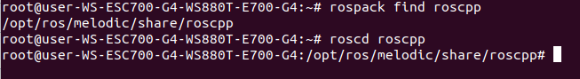

使用Ros指令
=
---

## 1.　Using rospack

>rospack允許你獲取有關package的信息。
```
$ rospack find <PackageName>
```
## 2.　Using roscd

>roscd 讓你能夠移動到package的目錄下
```
$ roscd <PackageName>
```
### 實驗：
> 先使用reospack查詢 "roscpp"的位置，不使用cd而是使用roscd移動到目錄下。



>！！！但是要記住的是使用這些方法查詢的package一定要是在ROS_PACKAGE_PATH中的。

## 3. 查詢ROS_PACKAGE_PATH收錄的位置
```
$ echo $ROS_PACKAGE_PATH

```
## 4. 使用 roscd log
>roscd日誌將帶您到ROS存儲日誌文件的文件夾。請注意，如果尚未運行任何ROS程序，這將產生一條錯誤消息，指出它尚不存在。 如果您以前運行過一些ROS程序，請嘗試：
```
$ roscd log
```

## 5. 使用 rosls
>有cd，當然就要有ls拉。
```
$ roscd <PackageName>
```

製作一個Package
=
---

>要稱為catkin的package，必須滿足一些要求：該軟件包必須包含兼容catkin的package.xml文件。package.xml文件提供有關軟件包的元信息。另外還需要包含使用catkin的CMakeLists.txt。大概長這樣：
```
my_package/
  CMakeLists.txt
  package.xml
```


